# Power Plan Switcher Tray App

A lightweight Windows system-tray utility for quickly switching between Windows power plans and configuring practical power-management behavior from a compact tray interface.

Version 2.0.0 expands the original switcher into a flexible Windows power-profile control tool with six built-in profiles, configurable cycling, Temporary Always On automation, Night Light and Energy Saver integration, persistent elevated startup, and a reorganized Advanced Settings menu.

---

## 📸 Screenshots

The screenshots below show the tray application in its different built-in power profiles, the compact main tray menu, the expanded Advanced Settings menu, Temporary Always On configuration and activation, the Windows Power Options integration, and the first-run elevated startup approval dialog.

### Power profiles

| Balanced | Energy Saving | Desktop Docking Station |
|---|---|---|
| 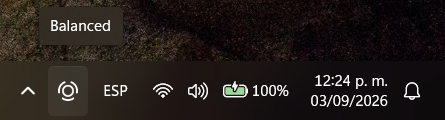 | 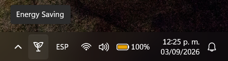 | 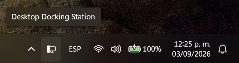 |

| Laptop On The Go | Always On | Night |
|---|---|---|
| 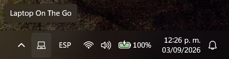 | 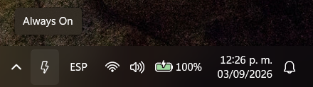 | 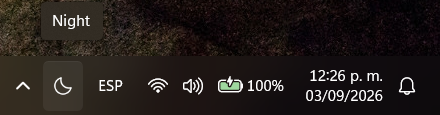 |

### Tray menus and configuration

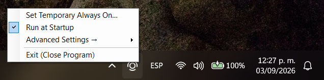

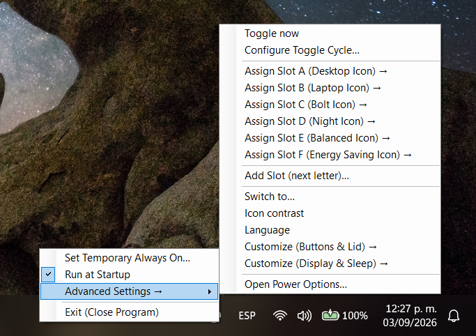

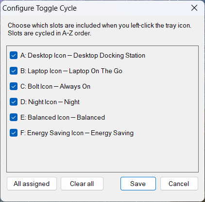

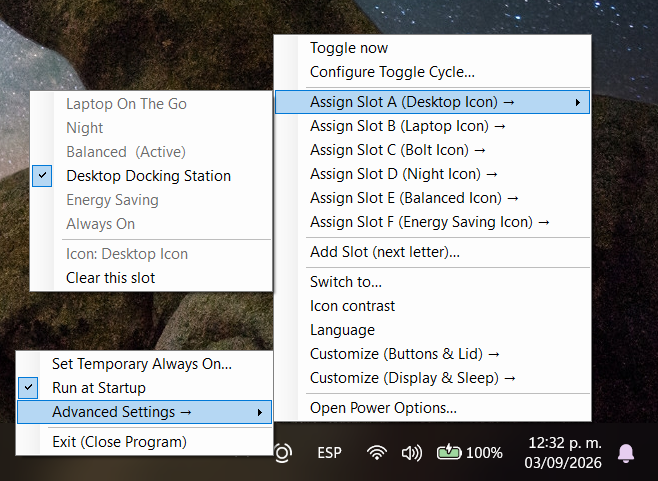

### Temporary Always On

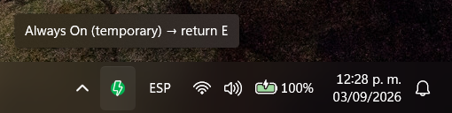

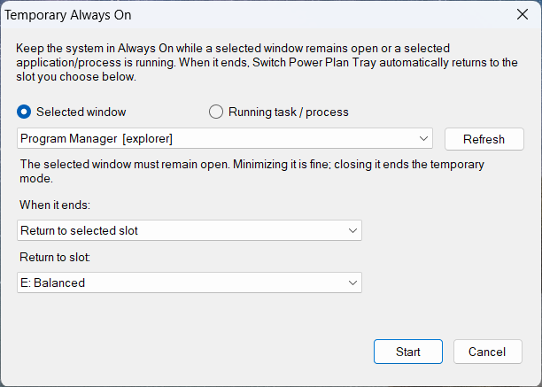

### Windows integration

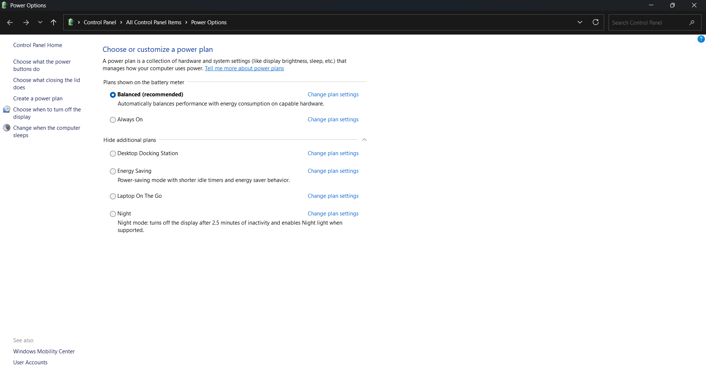

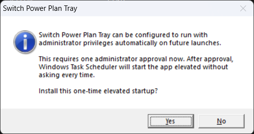

### Power-plan customization

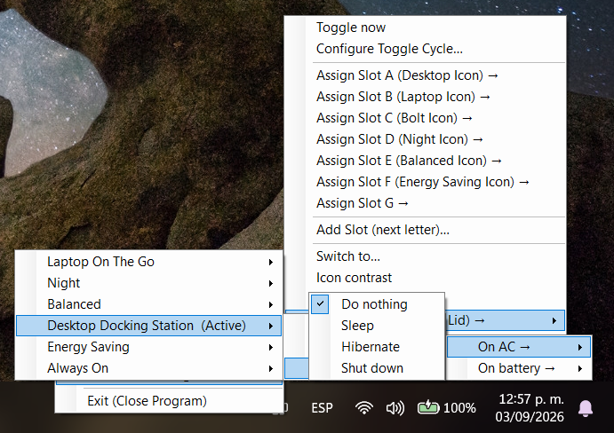

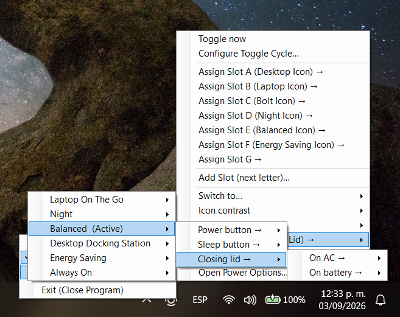

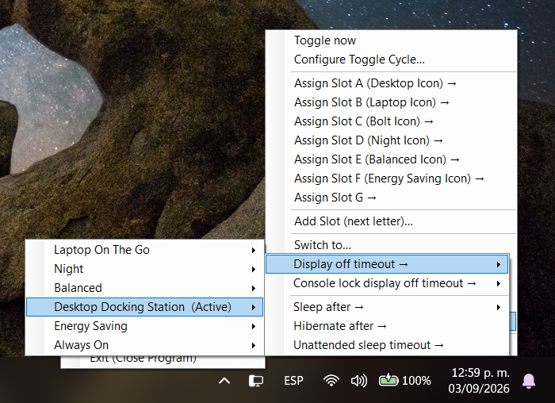

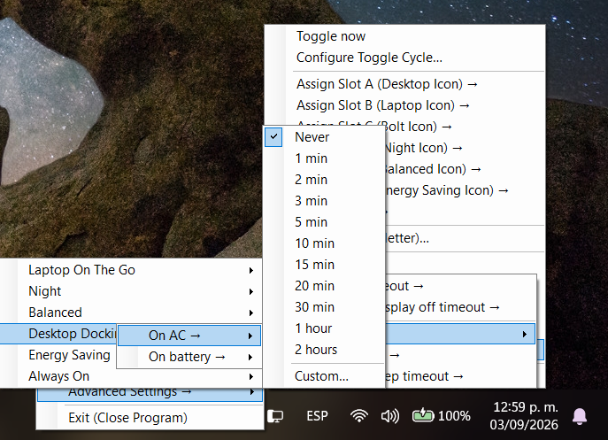

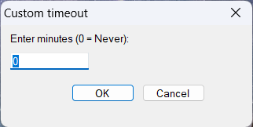

### Language and icon contrast

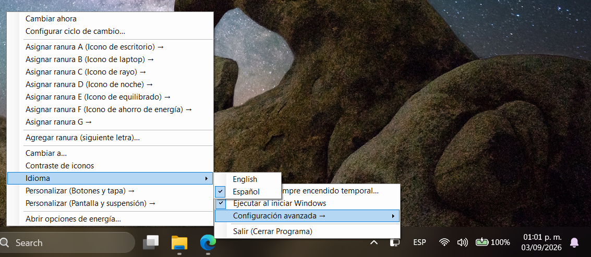

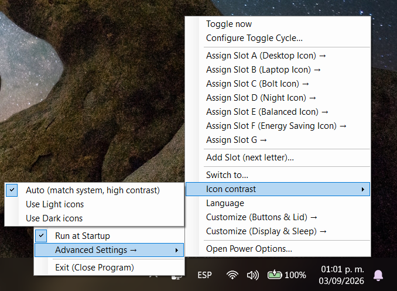

### Tray appearance

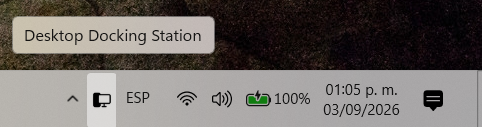

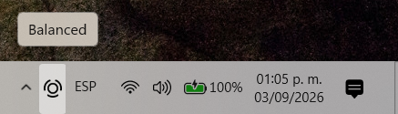

These screenshots illustrate the profile-specific tray icons, configurable slot cycling and assignment, power-plan button/lid and display/sleep customization, timeout presets, multilingual support, icon contrast options, Windows Power Options access, the one-time elevated startup setup, and the visual distinction used while Temporary Always On is active.

---

## ⭐ Features

### ⚡ Six built-in power profiles

The application provides six predefined slots:

| Slot | Default icon | Power configuration |
|---|---|---|
| **A** | Desktop | **Desktop Docking Station** |
| **B** | Laptop | **Laptop On The Go** |
| **C** | Bolt | **Always On** |
| **D** | Night | **Night** |
| **E** | Balanced | **Balanced** |
| **F** | Energy Saving | **Energy Saving** |

If any managed plan is missing, the application can create and configure it automatically without modifying an existing plan with the same purpose.

Each built-in slot has dedicated light/dark tray icons.

### 🔄 Configurable toggle cycle

Left-clicking the tray icon cycles through the selected slots only.

For example:

`A → D → F → A → D → F...`

The toggle-cycle configuration lets you include or exclude slots without removing their power-plan assignments.

### 🟢 Temporary Always On

Temporary Always On keeps the device on the **Always On** power configuration while a selected trigger remains active.

Supported triggers:

- Selected window
- Running task / process

When the trigger ends, the application can:

- Return to a selected slot
- Lock the device
- Sleep
- Hibernate
- Shut down
- Restart
- Do nothing and leave the device on Always On

While Temporary Always On is active, the tray uses:

- `Bolt_active_Dark.ico`
- `Bolt_active_Light.ico`

This provides a clear visual indication that the temporary Always On state is active.

### 🌙 Night Light integration

The Night profile can automatically enable Windows Night Light when entering Night and turn it back off when leaving Night when the application enabled it.

The app performs the operation without opening the Windows Quick Settings flyout.

### 🔋 Energy Saving integration

The Energy Saving profile combines:

- The dedicated **Energy Saving** power plan
- **Best Power Efficiency** Windows power mode
- Windows **Energy Saver** activation

Energy Saver operations are handled independently so slower policy changes do not block normal tray interaction or Night Light transitions.

### 🛡️ One-time administrator setup

On first launch, the application can request a one-time administrator approval and configure a persistent elevated startup task through Windows Task Scheduler.

After setup, the application can launch through the configured elevated task instead of requiring the user to manually choose **Run as administrator** on every launch.

### 🖥️ Windows compatibility and DPI support

The application includes an embedded Windows application manifest with Windows compatibility declarations and DPI awareness for better integration with modern Windows versions and high-DPI displays.

### 🎛️ Reorganized tray menu

The main tray menu is intentionally compact and focuses on the most common actions:

- **Set Temporary Always On**
- **Run at Startup**
- **Advanced Settings**
- **Exit (Close Program)**

Additional controls are grouped under **Advanced Settings**, including power-plan switching, cycle configuration, slot assignment, icon contrast, language, button/lid customization, display/sleep customization, and Windows Power Options.

### 🌐 Language support

The interface supports:

- **English**
- **Español**

The selected language is saved between launches. When no preference has been saved, the application uses the installed Windows UI language to choose between English and Spanish.

### 🎨 Icon and theme handling

The tray icon system supports:

- Dedicated light/dark icons for all six built-in slots
- Dedicated active icons for Temporary Always On
- Automatic icon selection based on the Windows theme
- Manual Light/Dark icon selection
- Custom icons for additional slots

Additional slots can use a custom `.ico` file. When only one variant is available, the app can generate an inverted counterpart for the alternate contrast mode.

### 🧩 Power-plan customization

The application exposes selected per-plan settings through the Windows Power Management API.

#### Buttons and lid

For each power plan, the following can be configured independently for **AC** and **battery**:

- Power button
- Sleep button
- Closing lid

Available actions:

- Do nothing
- Sleep
- Hibernate
- Shut down

#### Display and sleep

For each power plan, the following can be configured independently for **AC** and **battery**:

- Display off timeout
- Console-lock display off timeout
- Sleep after
- Hibernate after
- Unattended sleep timeout

Preset timeout values range from **Never** and 1 minute through 2 hours, with a **Custom…** option for entering a value in minutes.

### 🚀 Run at Startup

The built-in **Run at Startup** option stores a per-user startup entry under:

```text
HKEY_CURRENT_USER\Software\Microsoft\Windows\CurrentVersion\Run
```

The value name is:

```text
SwitchPowerTray
```

### ⚙️ Open Windows Power Options

The Advanced Settings menu provides **Open Power Options…**, which opens the classic Windows Power Options control panel.

---

## 💾 Configuration and persistence

User configuration is stored at:

```text
%APPDATA%\SwitchPowerTray\config.txt
```

Configuration includes:

- Slot-to-power-plan assignments
- Custom slot icon paths
- Icon contrast preference
- Language preference
- Toggle-cycle selection
- Temporary Always On configuration

Diagnostic/error logging is stored at:

```text
%TEMP%\SwitchPowerTray.log
```

The diagnostic log is rotated when it grows beyond approximately 1 MB.

---

## 🖱️ Menu interaction

The tray menu and nested submenus use normal Windows Forms behavior.

- Clicking outside an open menu closes the menu chain.
- **Esc** closes the most recently opened submenu one level at a time.
- Dialog-based commands close the menu before displaying the dialog.
- Menu rebuilds do not leave the previous menu chain stuck open.

---

## 🛡️ Runtime and Windows integration

The application includes safeguards for normal Windows desktop operation:

- Single-instance protection using a global mutex
- Automatic tray recovery after Windows Explorer/taskbar recreation
- Effective power-mode notifications for refreshing tray state
- Session-ending cleanup
- Native icon resource cleanup
- Native Windows Power Profile API integration
- Background handling for slower Energy Saver policy operations

---

## 🛠️ Build

No Visual Studio project is required.

The repository includes `Build.bat`, which locates the .NET Framework C# compiler and builds the application from the source and embedded icons.

### Required files

Keep these files together:

```text
SwitchPowerTray.cs
Build.bat
SwitchPowerTray.manifest
appicon.ico
Desktop_Dark.ico
Desktop_Light.ico
Laptop_Dark.ico
Laptop_Light.ico
Bolt_Dark.ico
Bolt_Light.ico
Bolt_active_Dark.ico
Bolt_active_Light.ico
Moon_Dark.ico
Moon_Light.ico
BalancedPower_Dark.ico
BalancedPower_Light.ico
SaveEnergy_Dark.ico
SaveEnergy_Light.ico
```

Then run:

```text
Build.bat
```

The resulting executable is:

```text
SwitchPowerTray.exe
```

The application is portable and stores user configuration separately under `%APPDATA%`.

---

## 📁 Repository structure

```text
Windows_PowerPlanSwitcher_TrayApp/
│
├── SwitchPowerTray.cs
├── Build.bat
├── SwitchPowerTray.manifest
├── appicon.ico
├── Desktop_Dark.ico
├── Desktop_Light.ico
├── Laptop_Dark.ico
├── Laptop_Light.ico
├── Bolt_Dark.ico
├── Bolt_Light.ico
├── Bolt_active_Dark.ico
├── Bolt_active_Light.ico
├── Moon_Dark.ico
├── Moon_Light.ico
├── BalancedPower_Dark.ico
├── BalancedPower_Light.ico
├── SaveEnergy_Dark.ico
├── SaveEnergy_Light.ico
├── screenshots/
│   ├── 01-balanced.png
│   ├── 02-energy-saving.png
│   ├── 03-desktop-docking-station.png
│   ├── 04-laptop-on-the-go.png
│   ├── 05-always-on.png
│   ├── 06-night.png
│   ├── 07-main-menu.png
│   ├── 08-advanced-settings.png
│   ├── 09-temporary-always-on.png
│   ├── 10-temporary-always-on-dialog.png
│   ├── 11-toggle-cycle.png
│   ├── 12-power-plan-assignment.png
│   ├── 13-windows-power-options.png
│   ├── 14-elevated-startup-approval.png
│   ├── 15-power-button-actions.png
│   ├── 16-closing-lid-actions.png
│   ├── 17-display-sleep-configuration.png
│   ├── 18-timeout-presets.png
│   ├── 19-custom-timeout.png
│   ├── 20-spanish-interface.png
│   ├── 21-icon-contrast.png
│   ├── 22-desktop-docking-station-tray.png
│   └── 23-balanced-tray.png
├── README.md
└── LICENSE
```

---

## 🪟 Windows compatibility

The application is designed for **Windows 10 and Windows 11** systems that provide the Windows Power Profile APIs used by the application. It is **not tied to a specific computer, manufacturer, or power-plan configuration**.

Most core functionality is designed to work across compatible Windows PCs. On first use, the application can create its managed built-in power plans when they are missing instead of requiring the exact plans from the development machine to already exist.

### Feature compatibility

| Feature | Windows 10/11 PCs | Notes |
|---|---|---|
| Power-plan switching | ✅ | Uses the Windows Power Profile APIs. |
| Built-in A–F profiles | ✅ | Missing managed plans can be created automatically. |
| Custom slots G–Z | ✅ | User assignments and icons are stored in the app configuration. |
| Toggle cycle | ✅ | Independent of the machine's existing plan names. |
| Temporary Always On | ✅ | Uses the application's managed Always On power configuration and Windows process/window state. |
| Startup / elevated Task Scheduler | ✅ | Requires the normal one-time administrator approval. |
| Light/Dark tray icons | ✅ | Uses the application's embedded icon resources. |
| Buttons & lid settings | ✅* | Available controls depend on the device hardware; desktops do not have a lid control. |
| Display & sleep settings | ✅ | Exact available behavior can depend on Windows and hardware. |
| Night Light integration | ⚠️ | Depends on the Night Light implementation/state available in the installed Windows version. |
| Energy Saving integration | ⚠️ | Depends on the Windows version and the power-management features available on the device. |

`✅*` means the feature is generally supported, but the actual hardware determines which controls are meaningful or exposed.

### Important compatibility notes

The exact power-plan settings available on a machine can depend on **hardware, firmware, Windows configuration, and the power schemes present on that system**. A desktop PC, laptop, and other device types may therefore expose different options even though the application itself is the same.

The **Night** and **Energy Saving** integrations are more Windows-version dependent than the core power-plan switching functionality. These features rely on Windows system features/state that may differ between Windows releases and device configurations.

The application uses the standard Windows Power Profile APIs for its core power-plan functionality and does not require the user's computer to have the developer's exact existing power-plan GUIDs. Managed plans use deterministic identifiers so the application can recognize or create its own plans on another compatible installation.

### Recommended support statement

For distribution, the project can reasonably be described as:

> **Designed for Windows 10 and Windows 11. Most power-plan management features work across compatible Windows systems, while certain integrations such as Night Light and Energy Saver depend on the Windows version and available system features.**

---

## 📄 License

This project is licensed under the **MIT License**.

See the included `LICENSE` file for the complete license text.

---

## 🙌 Contributions & Feedback

Issues, improvements, translations, and feature requests are welcome.
