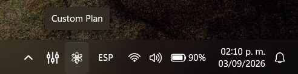
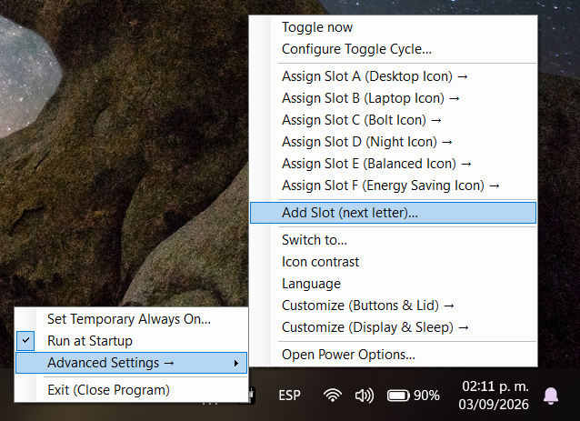
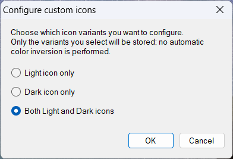
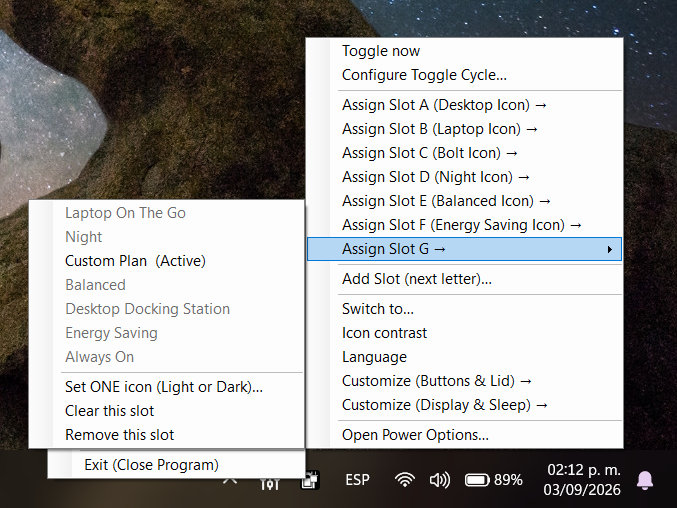

# Power Plan Switcher Tray App

A lightweight Windows system-tray utility for quickly switching between Windows power plans and controlling practical power-management behavior from a compact tray interface.

Version 2.0.0 turns the original switcher into a configurable power-profile tool with six built-in profiles, user-defined slots, configurable left-click cycling, Temporary Always On automation, Night Light and Energy Saver integration, per-plan power-control customization, bilingual UI support, explicit Light/Dark custom icons, and persistent elevated startup through Windows Task Scheduler.

---

## 📸 Screenshots

The screenshots below show the built-in profiles, tray menus, customization tools, Temporary Always On, Windows Power Options integration, multilingual support, icon contrast handling, and custom-slot icon configuration.

### Power profiles

| Balanced | Energy Saving | Desktop Docking Station |
|---|---|---|
|  |  |  |

| Laptop On The Go | Always On | Night |
|---|---|---|
|  |  |  |

### Tray menus and configuration


### Temporary Always On


### Windows integration


### Power-plan customization


### Language and icon contrast


### Custom icons









### Tray appearance


These screenshots illustrate the six built-in profiles, profile-specific tray icons, configurable slot cycling and assignment, Temporary Always On, per-plan button/lid and display/sleep customization, multilingual support, manual icon-contrast selection, explicit custom Light/Dark icon configuration, Windows Power Options access, and elevated startup setup.

---

## ⭐ Features

### ⚡ Six built-in power profiles

The application provides six predefined slots:

| Slot | Default icon | Power configuration |
|---|---|---|
| **A** | Desktop | **Desktop Docking Station** |
| **B** | Laptop | **Laptop On The Go** |
| **C** | Bolt | **Always On** |
| **D** | Night | **Night** |
| **E** | Balanced | **Balanced** |
| **F** | Energy Saving | **Energy Saving** |

When a managed built-in plan is missing, the application can create its own managed plan rather than requiring the development machine's existing plan configuration. Existing power plans with the requested built-in names are not reconfigured simply because they already exist.

### 🔄 Configurable toggle cycle

Left-clicking the tray icon cycles through the assigned slots that are enabled in the toggle cycle.

Slots are processed in A–Z order, allowing a compact cycle such as:

`A → D → F → A → D → F...`

The cycle selection is independent from slot assignment, so a slot can remain assigned while being excluded from left-click cycling.

### 🧩 Custom slots and icons

Additional slots can be created from **Add Slot (next letter)…**, starting at G and continuing through Z.

A custom slot can use either an `.ico` or `.png` file and can be configured in one of three explicit modes:

- **Light icon only**
- **Dark icon only**
- **Both Light and Dark icons**

The application **does not automatically invert custom icons**. The user explicitly chooses which contrast variants to provide.

When only one variant is configured, the other variant remains intentionally empty. Switching to that contrast mode therefore falls back to the application's normal icon instead of generating an inverted custom image.

When both variants are configured, the selected Light and Dark files are used directly for their corresponding modes.

PNG files are scaled proportionally and centered on the tray-icon canvas so the source artwork is not stretched. Square transparent PNG artwork is recommended; a **32×32 px transparent square** is a good source size for tray artwork.

ICO files are loaded at tray size so multi-resolution `.ico` files can be used without relying on automatic color inversion.

### 🟢 Temporary Always On

Temporary Always On keeps the device on the **Always On** power configuration while a selected trigger remains active.

Supported triggers:

- Selected window
- Running task / process

When the trigger ends, the application can:

- Return to a selected slot
- Lock the device
- Sleep
- Hibernate
- Shut down
- Restart
- Do nothing and leave the device on Always On

While Temporary Always On is active, the tray uses dedicated active Bolt icons to provide a clear visual indication of the temporary state.

### 🌙 Night Light integration

The Night profile can enable Windows Night Light when entering Night and can turn it back off when leaving Night when the application was the component that enabled it.

The app performs this integration without opening the Windows Quick Settings flyout.

### 🔋 Energy Saving integration

The Energy Saving profile combines:

- The dedicated **Energy Saving** power plan
- **Best Power Efficiency** Windows power mode
- Windows **Energy Saver** activation

The application keeps slower system-level Energy Saver policy operations out of the normal tray interaction path and reconciles the latest requested state independently.

### 🛡️ Persistent elevated startup

On first use, the application can request one administrator approval and register a persistent **`SwitchPowerTray Elevated`** task through Windows Task Scheduler.

The task launches the current executable with:

```text
/elevated-tray
```

The task is registered for logon with the highest available run level and is explicitly configured so that it is allowed to start on battery and does not stop merely because AC power is removed.

The application validates that the saved task points to the current executable before trusting an existing registration.

### 🎛️ Power-plan customization

Power-plan settings can be customized independently for **AC** and **battery**.

#### Buttons and lid

- Power button
- Sleep button
- Closing lid

Available actions:

- Do nothing
- Sleep
- Hibernate
- Shut down

#### Display and sleep

- Display off timeout
- Console-lock display off timeout
- Sleep after
- Hibernate after
- Unattended sleep timeout

Timeout presets include **Never**, minute-based values, and **Custom…** for entering a value in minutes.

### 🌐 Language support

The interface supports:

- **English**
- **Español**

The selected language is persisted. When no saved preference exists, the application can use the installed Windows UI language to choose between English and Spanish.

### 🎨 Icon contrast and theme handling

Built-in profiles have dedicated light/dark tray icon resources.

The **Icon contrast** menu supports:

- **Auto (match system, high contrast)**
- **Use Light icons**
- **Use Dark icons**

A theme change is detected while Auto mode is active so the tray icon can update without restarting the application.

For user-created slots, Light and Dark custom icons are configured explicitly rather than being synthesized from one another.

### 🪟 Windows compatibility and DPI support

The application is designed for compatible **Windows 10 and Windows 11** systems using the Windows Power Profile APIs. It is not tied to a specific computer, manufacturer, or pre-existing power-plan GUID set.

The application includes a Windows manifest with compatibility and DPI declarations for modern Windows environments.

Feature behavior can still vary with hardware and Windows version. In particular, lid controls depend on the device being a laptop or another system exposing a lid control, while Night Light and Energy Saving rely on Windows features/state that can differ between releases.

---

## 💾 Configuration and persistence

User configuration is stored at:

```text
%APPDATA%\SwitchPowerTray\config.txt
```

Configuration includes:

- Slot-to-power-plan assignments
- Custom Light/Dark icon paths for user-created slots
- Toggle-cycle selection
- Icon contrast preference
- Language preference
- Temporary Always On configuration

Diagnostic logging is stored at:

```text
%TEMP%\SwitchPowerTray.log
```

The diagnostic log is rotated when it exceeds approximately 1 MB.

---

## 🖱️ Menu interaction

The tray menu and nested submenus use normal Windows Forms behavior.

- Clicking outside an open menu closes the menu chain.
- **Esc** closes the most recently opened submenu one level at a time.
- Dialog commands close the menu before showing the dialog.
- Menu rebuilds do not leave a previous menu chain stuck open.

---

## 🔧 Runtime safeguards

The application includes several safeguards for normal Windows desktop operation:

- Single-instance protection using a global mutex
- Automatic tray recovery after Windows Explorer/taskbar recreation
- Effective power-mode notifications for refreshing the active tray state
- Session-ending cleanup
- Native icon resource cleanup
- Background handling for slower Energy Saver operations
- Validation of the persistent elevated Task Scheduler registration

---

## 🛠️ Build

No Visual Studio project is required.

The repository includes `Build.bat`, which locates the .NET Framework C# compiler and builds the application from source, the Windows manifest, and embedded built-in icons.

### Required build files

Keep these files together:

```text
SwitchPowerTray.cs
Build.bat
SwitchPowerTray.manifest
appicon.ico
Desktop_Dark.ico
Desktop_Light.ico
Laptop_Dark.ico
Laptop_Light.ico
Bolt_Dark.ico
Bolt_Light.ico
Bolt_active_Dark.ico
Bolt_active_Light.ico
Moon_Dark.ico
Moon_Light.ico
BalancedPower_Dark.ico
BalancedPower_Light.ico
SaveEnergy_Dark.ico
SaveEnergy_Light.ico
```

Then run:

```text
Build.bat
```

The resulting executable is:

```text
SwitchPowerTray.exe
```

User configuration is stored separately under `%APPDATA%`, so the application can be used as a portable executable without a Visual Studio project or installer.

---

## 📁 Repository structure

```text
Windows_PowerPlanSwitcher_TrayApp/
│
├── SwitchPowerTray.cs
├── Build.bat
├── SwitchPowerTray.manifest
├── appicon.ico
├── Desktop_Dark.ico
├── Desktop_Light.ico
├── Laptop_Dark.ico
├── Laptop_Light.ico
├── Bolt_Dark.ico
├── Bolt_Light.ico
├── Bolt_active_Dark.ico
├── Bolt_active_Light.ico
├── Moon_Dark.ico
├── Moon_Light.ico
├── BalancedPower_Dark.ico
├── BalancedPower_Light.ico
├── SaveEnergy_Dark.ico
├── SaveEnergy_Light.ico
├── screenshots/
│   ├── 01-balanced.png
│   ├── 02-energy-saving.png
│   ├── 03-desktop-docking-station.png
│   ├── 04-laptop-on-the-go.png
│   ├── 05-always-on.png
│   ├── 06-night.png
│   ├── 07-main-menu.png
│   ├── 08-advanced-settings.png
│   ├── 09-temporary-always-on.png
│   ├── 10-temporary-always-on-dialog.png
│   ├── 11-toggle-cycle.png
│   ├── 12-power-plan-assignment.png
│   ├── 13-windows-power-options.png
│   ├── 14-elevated-startup-approval.png
│   ├── 15-power-button-actions.png
│   ├── 16-closing-lid-actions.png
│   ├── 17-display-sleep-configuration.png
│   ├── 18-timeout-presets.png
│   ├── 19-custom-timeout.png
│   ├── 20-spanish-interface.png
│   ├── 21-icon-contrast.png
│   ├── 22-desktop-docking-station-tray.png
│   ├── 23-balanced-tray.png
│   ├── 24-custom-plan-tray-icon.png
│   ├── 25-add-custom-slot.png
│   ├── 26-custom-icon-type.png
│   └── 27-custom-slot-assigned-icon.png
├── README.md
└── LICENSE
```

---

## 🪟 Windows compatibility

The application is designed for **Windows 10 and Windows 11** systems that provide the Windows Power Profile APIs used by the application. It is **not tied to a specific computer, manufacturer, or power-plan configuration**.

Most core power-plan functionality is designed to work across compatible Windows PCs. On first use, the application can create its managed built-in power plans when they are missing instead of requiring the exact plans from the development machine to already exist.

### Feature compatibility

| Feature | Windows 10/11 PCs | Notes |
|---|---|---|
| Power-plan switching | ✅ | Uses the Windows Power Profile APIs. |
| Built-in A–F profiles | ✅ | Missing managed plans can be created automatically. |
| Custom slots G–Z | ✅ | Supports separate user-selected Light/Dark `.ico` or `.png` files. |
| Toggle cycle | ✅ | Includes only the assigned slots selected by the user. |
| Temporary Always On | ✅ | Uses the managed Always On power configuration and Windows window/process state. |
| Startup / elevated Task Scheduler | ✅ | Uses a persistent per-user task registration with one-time administrator approval. |
| Light/Dark tray icons | ✅ | Built-in profiles have dedicated icon resources; custom slots use explicitly configured variants. |
| Buttons & lid settings | ✅* | Available controls depend on device hardware; desktops do not expose a lid control. |
| Display & sleep settings | ✅ | Exact behavior can depend on Windows and hardware. |
| Night Light integration | ⚠️ | Depends on the Night Light implementation/state available in the installed Windows version. |
| Energy Saving integration | ⚠️ | Depends on the Windows version and power-management features available on the device. |

`✅*` means the feature is generally supported, but the actual hardware determines which controls are meaningful or exposed.

### Important compatibility notes

The exact power-plan controls and hardware actions available on a machine can depend on **hardware, firmware, Windows configuration, and the power schemes exposed by that system**. A laptop and desktop may therefore expose different options even though the application is the same.

The **Night Light** and **Energy Saving** integrations are more Windows-version dependent than the core power-plan switching features. Their underlying Windows system state can differ between Windows releases and device configurations.

The application does not require the developer's computer or existing power-plan GUIDs. Managed plans use deterministic identifiers so the application can recognize or create its own plans on another compatible installation.

### Recommended support statement

> **Designed for Windows 10 and Windows 11. Most power-plan management features work across compatible Windows systems, while certain integrations such as Night Light and Energy Saving depend on the Windows version and available system features.**

---

## 📄 License

This project is licensed under the **MIT License**.

See the included `LICENSE` file for the complete license text.

---

## 🙌 Contributions & Feedback

Issues, improvements, translations, and feature requests are welcome.
